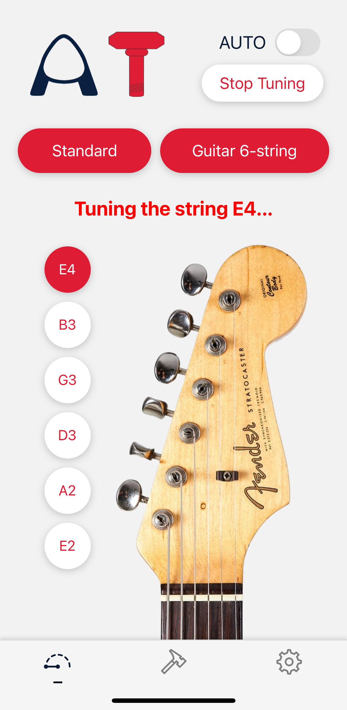
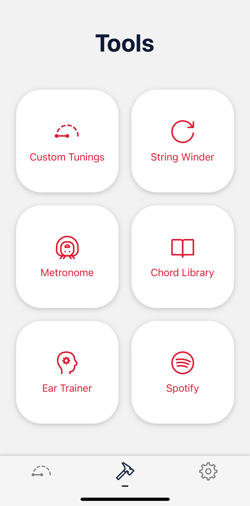
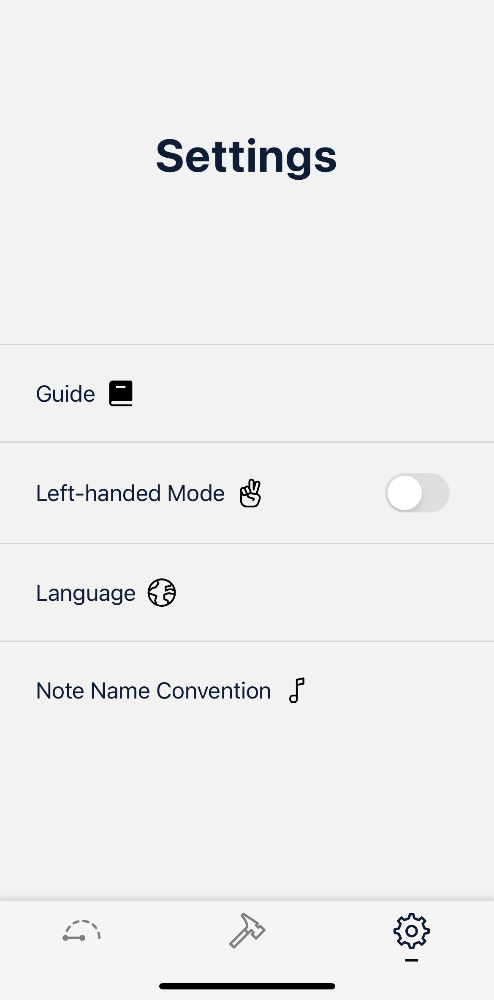
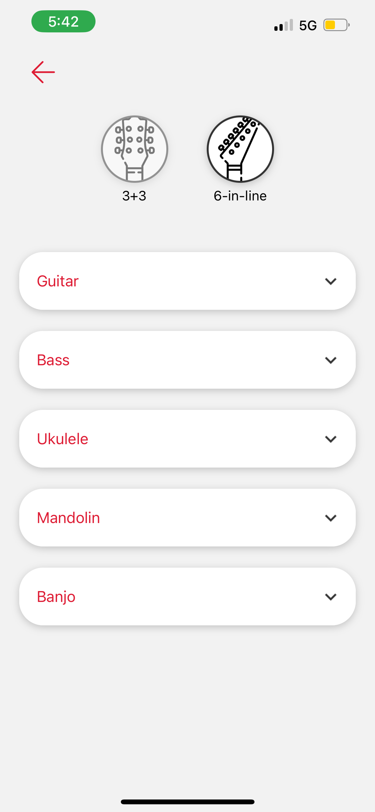
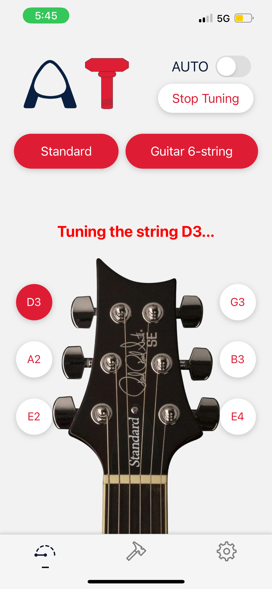
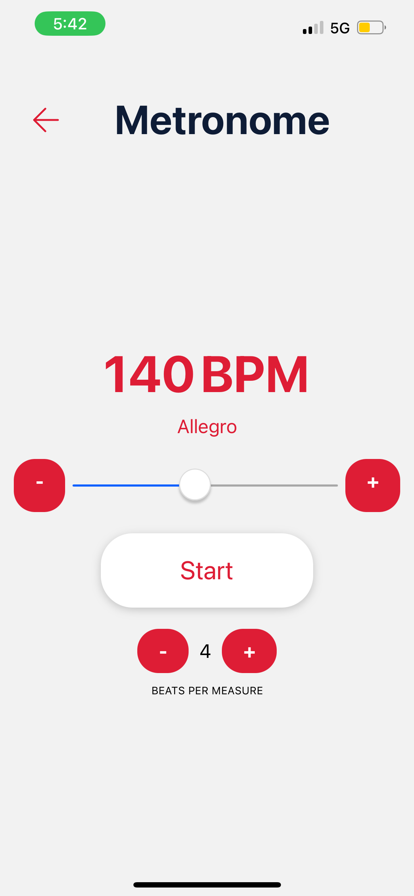
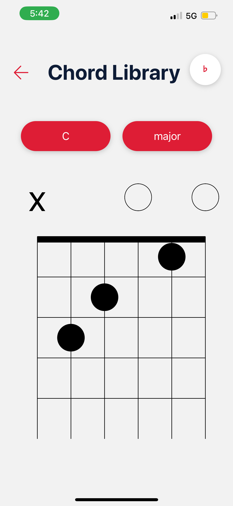
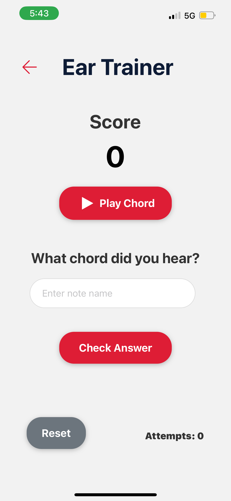
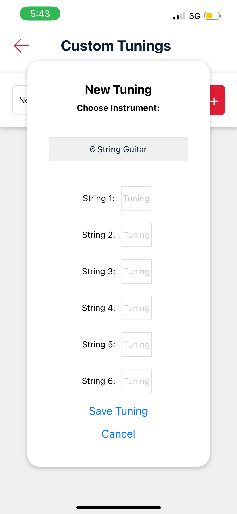
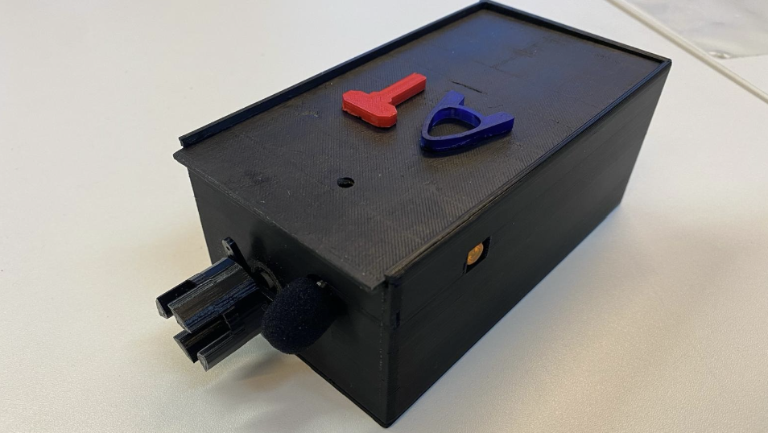

# Auto Tuned
The AT (AutoTunEd) mobile app connects to the AT handheld tuning device to tune ANY string instrument. <br>
Check out our video: https://github.com/user-attachments/assets/12eec65a-989b-4c5c-a19c-498c3b256abf <br> <br>
The System Design Project is a course involving the construction of a system with the theme in 2024 being “assistive robotics”. In a team of eight, we created the tuner robot and mobile app.<br>
https://informatics.ed.ac.uk/news-events/news/latest-news/informatics-students-showcase-assistive-robotics-sdp-course-trade-fair
# App
   <br><br>
  
<br><br>
   
 
 <br><br>
 # Tuner
 

# Dev
```
git clone https://github.com/imnotkate/AT.git
cd AT
npm install 
npx expo start
```
- download expo go from app / play store
- scan qr code using phone camera

NB: make sure pi and laptop are on the same network (e.g. phone hotspot) for the handheld tuner to work with the app
